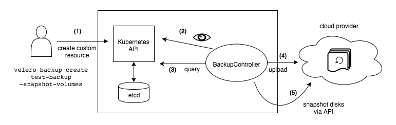

# Introduction

Velero (formerly Heptio Ark) provides capabilities to back up and restore your Kubernetes cluster resources and persistent volumes.

Velero lets you:

- Take backups of your cluster and restore in case of loss.
- Migrate cluster resources to other clusters.
- Replicate your production cluster to development and testing clusters.

Velero consists of:

- A server that runs on your cluster
- A command-line client that runs locally



Following sections include instructions to setup Velero on AKS cluster within UBS subscription.

# Intalling Velero on AKS cluster

The Velero backup tool consists of a client installed on your local computer and a server that runs in your Kubernetes cluster. To begin, we’ll install the local Velero client from [here](https://github.com/vmware-tanzu/velero/releases/tag/v1.4.2). Add Velero client to `PATH`.

Verify that you can run the velero client by executing the binary:

```
velero help

Output:
Velero is a tool for managing disaster recovery, specifically for Kubernetes
cluster resources. It provides a simple, configurable, and operationally robust
way to back up your application state and associated data.
```

## Prepare Credentials File

Edit the credentials with subscription and storage account used for backup.

```sh
$ cat << EOF  > ./credentials-velero
AZURE_SUBSCRIPTION_ID='<your-azure-subscription>'
AZURE_TENANT_ID='<ubs-prod-tenant-id>'
AZURE_CLIENT_ID='<aasp-client-id>'
AZURE_CLIENT_SECRET='<aasp-client-secret>'
AZURE_RESOURCE_GROUP='<managed-aks-resource-group (starts with MC_)>'
AZURE_CLOUD_NAME=AzurePublicCloud
EOF

```

## Installing Velero

A Velero installation consists of a number of Kubernetes objects that all work together to create, schedule, and manage backups. The velero executable that you just downloaded can generate and install these objects for you. The velero install command will perform the preliminary set-up steps to get your cluster ready for backups. Specifically, it will:

- Create a `velero` Namespace.
- Add the `velero` Service Account.
- Configure role-based access control (RBAC) rules to grant permissions to the `velero` Service Account.
- Install Custom Resource Definitions (CRDs) for the Velero-specific resources: `Backup`, `Schedule`, `Restore`, `Config`.
- Register Velero Plugins to manage Block snapshots and Spaces storage.

Run the `velero` install command with some non-default configuration options.

```sh
$ velero install \
--image poc-container-registry.ubs.net/velero/velero:v1.4.0 \
--provider azure \
--plugins poc-container-registry.ubs.net/velero/velero-plugin-for-microsoft-azure:v1.1.0 \
--velero-pod-cpu-limit 1 \
--velero-pod-mem-limit 1Gi \
--bucket <blob-container-name> \
--secret-file ./credentials-velero \
--backup-location-config resourceGroup=<storage-account-resourcegroup>,storageAccount=<storage-account-name>,subscriptionId=<storage-account-subscription-id> \
--snapshot-location-config apiTimeout=5m,resourceGroup=<snapshot-resourcegroup>,subscriptionId=<snapshot-subscription-id>

```

# Testing Backup and Restore Procedure

Now that we’ve successfully installed and configured Velero, we can create a test `azure-vote` deployment, with a Persistent Volume and Service. Once the Deployment is running we will run through a backup and restore drill to ensure that Velero is configured and working properly.

## Deploy Voting App

We will be deploying a sample Voting App for testing Velero backup/restore capabilities. Voting App consists of two microservices:
1. `voting-frontend` - A python based web app
2. `voting-backend` - A redis store with persistent volume

Create a namespace `azure-vote` where the application will be deployed.

```sh
$ kubectl create namespace azure-vote
```

Create a TLS secret using certificate created from previous step in `azure-vote` namespace. Kubernetes Ingress Controller will be configured to use this certificate for securing endpoint using TLS.

```sh
kubectl create secret tls ingress-tls-cert -n azure-vote --key /path-to-key-file.key --cert /path-to-key-file.crt
```

Apply the manifest `examples/azure-vote-deploy.yaml` to deploy Voting App in `azure-vote` namespace.

```sh
$ kubectl apply -f examples/azure-vote-deploy.yaml

OUTPUT:

deployment.apps/voting-backend created
service/voting-backend created
deployment.apps/voting-frontend created
service/voting-frontend created
```

Check whether Voting App got deployed successfully.

```sh
$ kubectl get all -n azure-vote

OUTPUT:

NAME                                  READY   STATUS    RESTARTS   AGE
pod/voting-backend-854dd7cd8d-2qn7m   1/1    Running   0          11s
pod/voting-frontend-d4657b7bc-86xkx   1/1     Running   0          11s

NAME                      TYPE        CLUSTER-IP       EXTERNAL-IP   PORT(S)    AGE
service/voting-backend    ClusterIP   10.251.103.214   <none>        6379/TCP   11s
service/voting-frontend   ClusterIP   10.251.93.142    <none>        80/TCP     11s

NAME                              READY   UP-TO-DATE   AVAILABLE   AGE
deployment.apps/voting-backend    1/1     1            1           12s
deployment.apps/voting-frontend   0/1     1            0           11s

NAME                                        DESIRED   CURRENT   READY   AGE
replicaset.apps/voting-backend-854dd7cd8d   1         1         1       12s
replicaset.apps/voting-frontend-d4657b7bc   1         1         0       11s
```

Verify whether the app is loading in the brower by entering host configured above.

> Chrome: https://<FQDN>/

## Back up persistent volumes of Voting App using Velero

We’ll create a backup called `azure-vote-bkp` using the `velero` command line client. `--selector` option identifies resources by label. `--include-resources` option limits backup of specified resource types. In our example, we will backup `pv` (persistenvolume) and `pvc` (persistentvolumeclaim) resources only.

```yaml
$ velero backup create azure-vote-bkp --include-resources pvc,pv --selector app=azure-vote
```

Check whether backup was successful. Add `--details` for more information.

```yaml
$ velero backup describe azure-vote-bkp
```

```
Output
Name:         azure-vote-bkp
Namespace:    velero
Labels:       velero.io/storage-location=default
Annotations:  velero.io/source-cluster-k8s-gitversion=v1.16.10
              velero.io/source-cluster-k8s-major-version=1
              velero.io/source-cluster-k8s-minor-version=16

Phase:  Completed

Errors:    0
Warnings:  0

Namespaces:
  Included:  *
  Excluded:  <none>

Resources:
  Included:        pvc, pv
  Excluded:        <none>
  Cluster-scoped:  auto

Label selector:  app=azure-vote

Storage Location:  default

Velero-Native Snapshot PVs:  auto

TTL:  720h0m0s

Hooks:  <none>

Backup Format Version:  1

Started:    2020-08-18 17:25:10 +0530 IST
Completed:  2020-08-18 17:25:22 +0530 IST

Expiration:  2020-09-17 17:25:10 +0530 IST

Total items to be backed up:  2
Items backed up:              2

Velero-Native Snapshots:  1 of 1 snapshots completed successfully (specify --details for more information)
```

We can now test the restore procedure.

## Delete Voting App

Let’s first delete the `azure-vote` Namespace to simulate a failure. This will delete all resources in the Namespace, including the Persistent Volume:

```sh
$ kubectl delete namespace azure-vote
```

Verify that you can no longer access Voting App from the browser, and that the `azure-vote` resources are no longer running:

```sh
kubectl get all -n azure-vote

OUTPUT:

No resources found in azure-vote namespace.
```

We can now perform the restore procedure, using the `velero` client.

## Restore Voting App using velero

Create the namespace `azure-vote` where the application will be restored.

```sh
$ kubectl create namespace azure-vote
```

Create a Velero Restore object from the `azure-vote-bkp` Backup object.

```yaml
velero restore create --from-backup azure-vote-bkp
```

Verify whether persistent volume resources have been restored in `azure-vote` namespace.

```sh
kubectl get pvc,pv --namespace azure-vote
```

```
OUTPUT:

NAME                                    STATUS   VOLUME                                     CAPACITY   ACCESS MODES   STORAGECLASS      AGE
persistentvolumeclaim/azure-vote-back   Bound    pvc-c9b439a8-1962-4a23-a139-66a5114cb029   1Gi        RWO            managed-premium   109s

NAME                                                        CAPACITY   ACCESS MODES   RECLAIM POLICY   STATUS   CLAIM                        STORAGECLASS      REASON   AGE
persistentvolume/pvc-c9b439a8-1962-4a23-a139-66a5114cb029   1Gi        RWO            Delete           Bound    azure-vote/azure-vote-back   managed-premium            109s
```

## Redeploy Voting App

Deploy rest of the Voting App resources using `kubectl` apply:

```sh
$ kubectl apply -f examples/azure-vote-deploy.yaml
```

Check status of the pods.

```sh
$ kubectl get pods -n azure-vote

OUTPUT:

NAME                               READY   STATUS    RESTARTS   AGE
azure-vote-back-5b944bc5d5-l554m   1/1     Running   0          46s
azure-vote-front-d8ff6fccd-jbrf2   1/1     Running   0          45s
```

Verify whether the app is loading in brower by entering host url.

> Chrome: https://kd43e539473wma01k8s.aks.azure.ubsdev.net/

## Cluster Level Backup/Restoration

To perform cluster level backup/restore, both cluster should have similar `backup-location` & `snapshot-location`. Also, The default sync interval is set as 1 minute. You could change the interval with the flag `--backup-sync-period` when creating a backup location.

While performing backup, after default sync-time, backup objects will be visible in both the clusters when running `velero get backup` command. Post which, restoration can be initiated. However, Restore & Schedule objects will be visible under respective clusters only, as they are cluster specific features.

# Cleanup

## Uninstall Voting App

```sh
kubectl delete namespace azure-vote
```

## Uninstall Velero

The following commands will remove all resources created by velero install:

```sh
kubectl delete namespace/velero clusterrolebinding/velero
kubectl delete crds -l component=velero

```

# Next Steps

- Velero can also be used to schedule regular backups of your Kubernetes cluster for disaster recovery. To do this, you can use the `velero schedule` command. 
